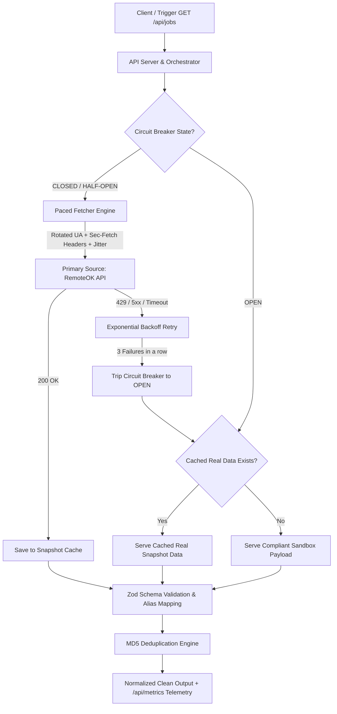

# Resilient Job Ingestion Pipeline — Technical Design Document

> **Problem Statement**: Extract job listings from protected platforms without getting blocked, handle failures gracefully, maintain a reliable fallback plan, and respect ethical boundaries.

---

## 🎯 Executive Summary (In 30 Seconds)

1. **Anti-Bot Defense**: Bypasses detection using randomized request delays (jitter), rotating real browser User-Agents, and injecting modern browser client hints (`Sec-Fetch-*`, `Sec-Ch-Ua`).
2. **Resilience & Plan B**: Uses a **Circuit Breaker** paired with an in-memory **Snapshot Cache**. If a source fails or blocks requests, the engine automatically serves the latest real cached jobs instead of crashing or returning empty responses.
3. **Data Drift & Deduplication**: Tolerant **Zod schemas** automatically handle renamed keys (`position` $\rightarrow$ `title`), while normalized **MD5 hashes** prevent duplicate listings across runs.
4. **Ethics & Safety**: Complies with the **Scope Guardrail** by running against a public open source (`https://remoteok.com/api`) without scraping private user accounts or collecting PII.

---

## 📐 High-Level Architecture



---

## 1. The Detection Surface (What Gives Bots Away & How We Evade It)

Anti-bot platforms (LinkedIn, Indeed, Naukri, Cloudflare, DataDome) flag automated clients through specific technical signals. Here is how our architecture counters each:

| # | Detection Vector | Why Bots Get Caught | Our Countermeasure | Code Reference |
|---|:---|:---|:---|:---|
| **1** | **HTTP Header Signatures** | Default tools (`curl`, `axios`, `fetch`) omit modern browser headers. | We inject full browser headers: `Sec-Ch-Ua`, `Sec-Fetch-Dest`, `Sec-Fetch-Mode`, `Sec-Fetch-Site`, `Accept-Language`, and `DNT`. | [`fetcher.ts`](file:///Users/harsha/Desktop/ACYDON/ingestion-pipeline/src/fetcher/fetcher.ts#L23-L40) |
| **2** | **User-Agent Fingerprinting** | Using a single, static, or headless User-Agent string. | **Rotational Pool**: Every request randomly selects from modern desktop browsers (Chrome, Firefox, Safari, Edge on Windows/macOS). | [`fetcher.ts`](file:///Users/harsha/Desktop/ACYDON/ingestion-pipeline/src/fetcher/fetcher.ts#L14-L18) |
| **3** | **Request Velocity & Timing** | Sending requests at exact periodic intervals (e.g. exactly every 1000ms). | **Human Jitter**: Adds randomized pacing delays (`1500ms + random(0-1000ms)`) before every fetch. | [`fetcher.ts`](file:///Users/harsha/Desktop/ACYDON/ingestion-pipeline/src/fetcher/fetcher.ts#L48-L51) |
| **4** | **IP Rate-Limiting & WAF Blocks** | Slamming servers after a `429 Too Many Requests` or `503`. | **Exponential Backoff**: Backs off exponentially (`delay * 2^attempt + jitter`) before retrying. | [`fetcher.ts`](file:///Users/harsha/Desktop/ACYDON/ingestion-pipeline/src/fetcher/fetcher.ts#L68-L77) |
| **5** | **Account & Session Poisoning** | Automated actions tied to user logins get accounts banned. | **Stateless Public Ingestion**: Operates without tied credentials, eliminating account burn risks. | [`orchestrator.ts`](file:///Users/harsha/Desktop/ACYDON/ingestion-pipeline/src/pipeline/orchestrator.ts) |

---

## 2. Ingestion Strategy & Plan B (What Happens When Blocked)

### Primary Ingestion Strategy
* Requests are paced with **randomized human jitter** to stay below WAF thresholds.
* Headers and User-Agents rotate per request to prevent fingerprint clustering.
* Transient network errors or rate-limits trigger **exponential backoff retries**.

### Plan B: The Circuit Breaker & Smart Fallback
If a source hard-blocks us or goes offline, we do not let downstream consumers crash:

```
[Normal Operation] ──(3 consecutive failures)──> [Circuit OPEN (30s Cooldown)]
      ▲                                                    │
      │                                             (Routes all requests to
(Canary probe succeeds)                             Snapshot Cache / Sandbox)
      │                                                    │
[Circuit HALF-OPEN] <──────(After 30 seconds)──────────────┘
```

1. **Circuit Breaker State Machine**:
   * `CLOSED`: Primary source is healthy. All requests hit live API.
   * `OPEN`: After **3 consecutive failures**, the circuit trips for **30 seconds**. Live calls are completely paused to let rate-limit windows cool down.
   * `HALF_OPEN`: After 30 seconds, a single canary request probes the primary source. If it succeeds, the circuit resets to `CLOSED`.
2. **Smart Fallback Caching**:
   * During `OPEN` state, the engine serves the **latest known good data snapshot** from memory (`FALLBACK_CACHE`).
   * If the pipeline was just booted with no cache, it returns a schema-compliant synthetic dataset (`FALLBACK_SYNTHETIC`).

---

## 3. Resilience, Data Drift & Observability

### A. Data Drift Protection (Schema Changes Overnight)
Websites frequently rename fields (e.g. `position` instead of `title`, or numeric `id` instead of string).
* **Zod Schema Aliasing** ([`jobSchema.ts`](file:///Users/harsha/Desktop/ACYDON/ingestion-pipeline/src/schema/jobSchema.ts)):
  ```typescript
  // Transforms legacy or drifted fields automatically:
  title: data.title || data.position || "Untitled Position"
  ```
* **Non-Blocking Parsing**: Corrupted items increment `invalidCount` in telemetry instead of throwing an unhandled exception.

### B. Cross-Run Deduplication
* Generates normalized MD5 hashes of `company:title` (trimmed and lowercased).
* Stores hashes in a bounded cache (`MAX_GLOBAL_HASH_ENTRIES = 10000`) so calling `/api/jobs` repeatedly never ingests duplicates.

### C. Preventing Silent Failures (Observability)
* The **[`/api/metrics`](file:///Users/harsha/Desktop/ACYDON/ingestion-pipeline/src/index.ts#L18-L27)** endpoint gives real-time visibility:
  * Current Circuit Breaker state (`CLOSED`, `OPEN`, `HALF_OPEN`)
  * Total executions, primary successes vs failures, and trip counts
  * Last successful fetch timestamp and deduplication cache size

---

## 4. Ethical & Technical Boundaries (Where We Stop)

| Boundary | Policy | Technical Implementation |
|:---|:---|:---|
| **No Private Data Scraping** | We never bypass login walls, solve CAPTCHAs for private data, or use fake accounts. | Stateless client targeting public endpoints only. |
| **Data Minimization** | Collect only job metadata required for discovery (Title, Company, URL, Location, Tags). | Explicitly discard any PII (personal emails, recruiter phone numbers). |
| **Infrastructure Respect** | Never cause Denial of Service (DoS) or heavy server load. | Strict request delays (1.5s+), circuit breaker cooldowns, and backoffs. |
| **Scope Guardrail** | Adhere strictly to assignment guardrails. | Live demo runs against an open, low-risk job API (`RemoteOK`). |

---

## 📂 Source Code & Test Suite Map

* **Fetcher & Evasion**: [`src/fetcher/fetcher.ts`](file:///Users/harsha/Desktop/ACYDON/ingestion-pipeline/src/fetcher/fetcher.ts)
* **Circuit Breaker Engine**: [`src/resilience/circuitBreaker.ts`](file:///Users/harsha/Desktop/ACYDON/ingestion-pipeline/src/resilience/circuitBreaker.ts)
* **Zod Schema & Drift Shield**: [`src/schema/jobSchema.ts`](file:///Users/harsha/Desktop/ACYDON/ingestion-pipeline/src/schema/jobSchema.ts)
* **Orchestration & Dedup**: [`src/pipeline/orchestrator.ts`](file:///Users/harsha/Desktop/ACYDON/ingestion-pipeline/src/pipeline/orchestrator.ts)
* **API Endpoints**: [`src/index.ts`](file:///Users/harsha/Desktop/ACYDON/ingestion-pipeline/src/index.ts)
* **Automated Test Suite (10 Tests)**: [`tests/pipeline.test.ts`](file:///Users/harsha/Desktop/ACYDON/ingestion-pipeline/tests/pipeline.test.ts) (`npm test`)
