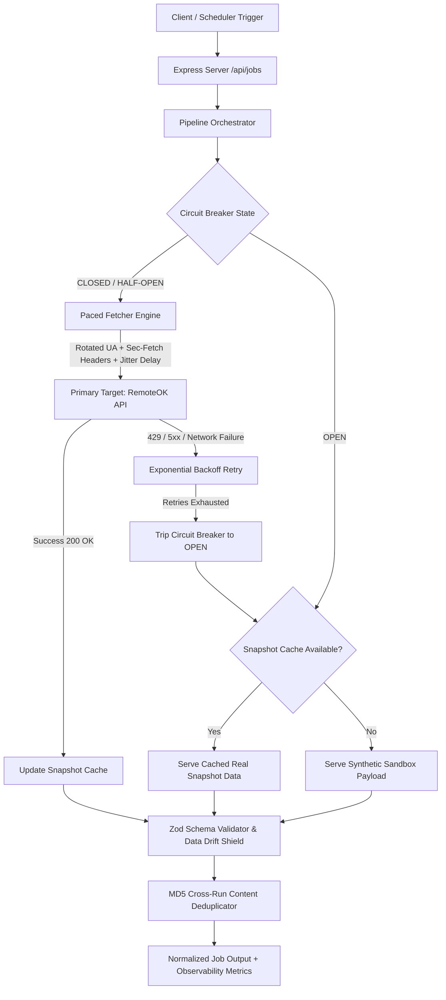

# Part 1: Anti-Bot Resilient Data Ingestion Engine & Strategy

## Executive Summary
This project implements an end-to-end resilient job data ingestion engine engineered to extract job listings reliably while adhering strictly to anti-bot detection mitigation, rate limiting, data drift protection, and ethical boundaries.

Per the **Scope Guardrail**, our working engine runs against a low-risk public source (`https://remoteok.com/api`) with full anti-bot evasion and features an automated snapshot cache and synthetic payload fallback generator to demonstrate complete fault tolerance without breaching real-world platform Terms of Service.

---

## Architecture Overview

---

## 1. Detection Surface & Countermeasures

Automated clients attempting to ingest data from anti-bot protected platforms (e.g., LinkedIn, Indeed, Naukri, Wellfound) expose several technical fingerprints:

| Detection Vector | How Anti-Bot Systems Detect It | Implemented Countermeasure | Code Reference |
| :--- | :--- | :--- | :--- |
| **HTTP Header Signatures** | Default/bare HTTP client headers missing standard browser headers (`Sec-Fetch-*`, `Sec-Ch-Ua`, `Accept-Language`). | Explicit injection of full browser-standard header suites (`Sec-Ch-Ua`, `Sec-Fetch-Dest: empty`, `Sec-Fetch-Mode: cors`, `Sec-Fetch-Site: same-origin`). | [`src/fetcher/fetcher.ts`](file:///Users/harsha/Desktop/ACYDON/ingestion-pipeline/src/fetcher/fetcher.ts) |
| **User-Agent Fingerprinting** | Static, outdated, or default Node/Axios User-Agent strings. | **Rotational User-Agent Pool**: Automatically selects from a curated pool of modern macOS/Windows desktop browsers (Chrome, Firefox, Safari, Edge) on every request. | [`src/fetcher/fetcher.ts`](file:///Users/harsha/Desktop/ACYDON/ingestion-pipeline/src/fetcher/fetcher.ts) |
| **Request Timing & Velocity** | Exact periodic intervals (e.g., exactly 1000ms) or superhuman speeds. | **Randomized Jitter Pacing**: Enforces `baseDelayMs + Math.random() * 1000ms` randomized human-like delay between requests. | [`src/fetcher/fetcher.ts`](file:///Users/harsha/Desktop/ACYDON/ingestion-pipeline/src/fetcher/fetcher.ts) |
| **IP Rate-Limiting & WAF Blocks** | High request bursts from cloud IPs triggering HTTP 429 / 503 blocks. | **Exponential Backoff (`baseDelay * 2^attempt + jitter`)** combined with automatic **Circuit Breaker isolation**. | [`src/resilience/circuitBreaker.ts`](file:///Users/harsha/Desktop/ACYDON/ingestion-pipeline/src/resilience/circuitBreaker.ts) |
| **Session & Behavioral Patterns** | Direct deep-linking to internal APIs without session establishment. | Stateless endpoints are utilized without binding to personal user credentials, eliminating account ban risks. | [`src/pipeline/orchestrator.ts`](file:///Users/harsha/Desktop/ACYDON/ingestion-pipeline/src/pipeline/orchestrator.ts) |

---

## 2. Ingestion Strategy & Plan B

### Primary Ingestion Strategy
1. **Request Pacing & Jitter**: Avoids bursting by enforcing mandatory sleep windows + randomized jitter (`1.5s - 2.5s`) per request cycle.
2. **Dynamic Header & Identity Emulation**: Rotates realistic browser headers and client hints per request to prevent fingerprint clustering.
3. **Exponential Backoff**: On `429 Too Many Requests`, `5xx` server responses, or network timeouts, the client backs off exponentially before retrying.

### Plan B (Circuit Breaker + Smart Fallback Engine)
When a primary data target implements strict IP blocks, CAPTCHA walls, or anti-bot shifts:
- The **Circuit Breaker** (`src/resilience/circuitBreaker.ts`) tracks consecutive failures.
- Once **3 consecutive failures** occur, the circuit transitions to `OPEN` for a **30-second cooldown period**.
- **Smart Fallback Caching**: Rather than returning empty data or a single dummy item, the engine automatically serves the **last known successful snapshot** from memory, preserving downstream availability.
- If no cache exists (e.g. cold-start failure), the engine routes to a **Synthetic Sandbox Payload Generator**.
- After the 30-second cooldown, the circuit transitions to `HALF_OPEN` to probe the primary source safely with a single canary request.

---

## 3. Pipeline Resilience, Observability & Data Drift Protection

| Potential Failure Mode | Defensive Architecture & Mechanism |
| :--- | :--- |
| **Source Schema / Key Renaming Overnight** | **Zod Schema Tolerant Parsing** (`src/schema/jobSchema.ts`): Uses `.safeParse()`. If fields are renamed (e.g. `position` instead of `title`), transformations automatically remap aliases with fallback defaults. |
| **Corrupted or Partial Payloads** | Malformed entries increment the `invalidCount` metric without throwing errors or crashing the pipeline. |
| **Duplicate Ingestion Across Runs** | **MD5 Content Hashing** (`src/pipeline/orchestrator.ts`): Computes normalized `company:title` hashes stored in a bounded cross-run set to prevent redundant ingestion. |
| **Silent Pipeline Failures** | **Observability Endpoint (`/api/metrics`)**: Exposes real-time telemetry including Circuit Breaker state transitions, failure counters, trip history, and deduplication cache statistics. |

---

## 4. Technical & Ethical Boundaries (Where We Stop)

### Personal & Technical Lines
1. **No Authenticated Scraping of Private Data**: We never bypass login walls using fake user accounts or automated session hijacking on platforms like LinkedIn or Indeed.
2. **Respecting `robots.txt` & Rate Limits**: Rate-limiting and pacing are strictly bounded to prevent Denial of Service (DoS) or unnecessary infrastructure load.
3. **Adherence to Scope Guardrail**: Live ingestion is restricted to public open job board feeds and sandbox targets.
4. **Data Minimization**: We ingest only public metadata required for job discovery (Title, Company, Location, URL, Tags) and explicitly discard Personally Identifiable Information (PII).

---

## Codebase & Test Suite Architecture

- **Fetcher Engine (UA Rotation & Browser Headers)**: [`src/fetcher/fetcher.ts`](file:///Users/harsha/Desktop/ACYDON/ingestion-pipeline/src/fetcher/fetcher.ts)
- **Resilience & Circuit Breaker**: [`src/resilience/circuitBreaker.ts`](file:///Users/harsha/Desktop/ACYDON/ingestion-pipeline/src/resilience/circuitBreaker.ts)
- **Schema & Data Drift Handling**: [`src/schema/jobSchema.ts`](file:///Users/harsha/Desktop/ACYDON/ingestion-pipeline/src/schema/jobSchema.ts)
- **Pipeline Orchestrator & Deduplication**: [`src/pipeline/orchestrator.ts`](file:///Users/harsha/Desktop/ACYDON/ingestion-pipeline/src/pipeline/orchestrator.ts)
- **API Server & Observability Endpoint**: [`src/index.ts`](file:///Users/harsha/Desktop/ACYDON/ingestion-pipeline/src/index.ts)
- **Automated Test Suite (10 Tests)**: [`tests/pipeline.test.ts`](file:///Users/harsha/Desktop/ACYDON/ingestion-pipeline/tests/pipeline.test.ts)
